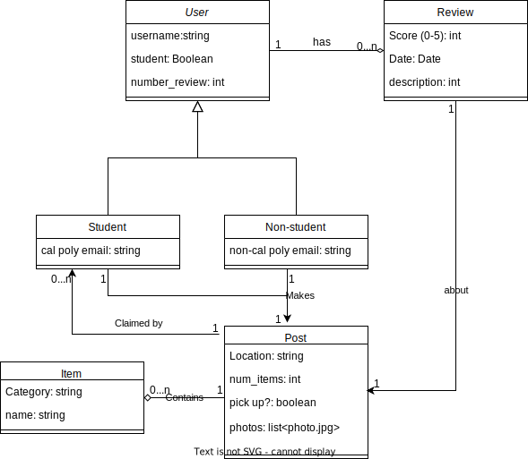

The following is our initial UML diagram as submitted on 10/30/23. 
This diagram is slightly out of date, and the changes are as follows: 
1. The user class is no longer broken down into student and non-student, and rather the class
   has a boolean attribute that determines if the account belongs to a student.
3. The user class has additional attributes for address, name, and zip. This info is just to help
   flesh out a user's account and allow a post to utilize this info.

